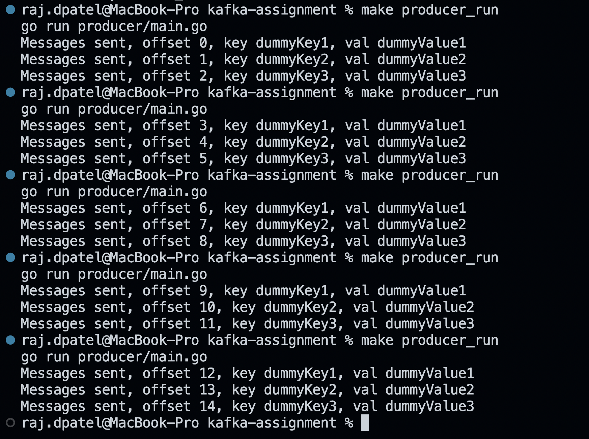
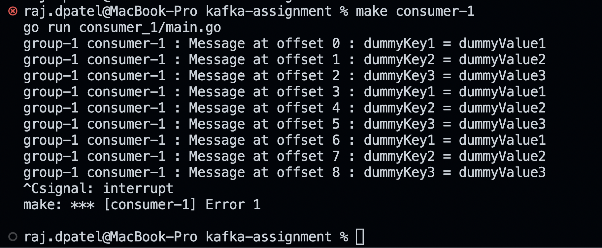
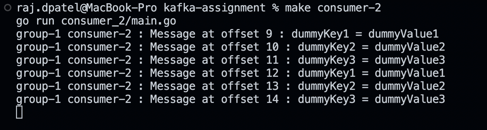
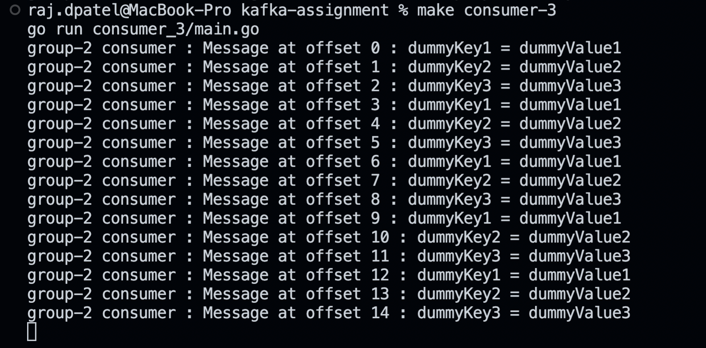

## Kafka Assignment

Consumer groups :

- `group-1` : consumer_1, consumer_2
- `group-2` : consumer_3

---
To run kafka and zookeeper :
`make start`

To stop kafka and zookeeper :
`make stop`

To run the producer : `make producer`

To run consumers :

- consumer_1 : `make consumer_1`
- consumer_2 : `make consumer_2`
- consumer_3 : `make consumer_3`
  
---
Producer logs :

Consumer-1:

Consumer-2 (Consumes when Consumer-1 of same group is unavailable):

Consumer-3:
